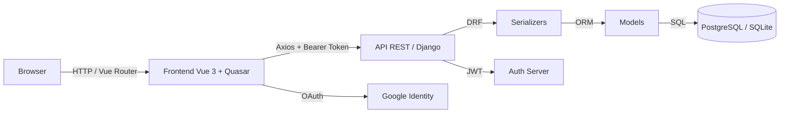
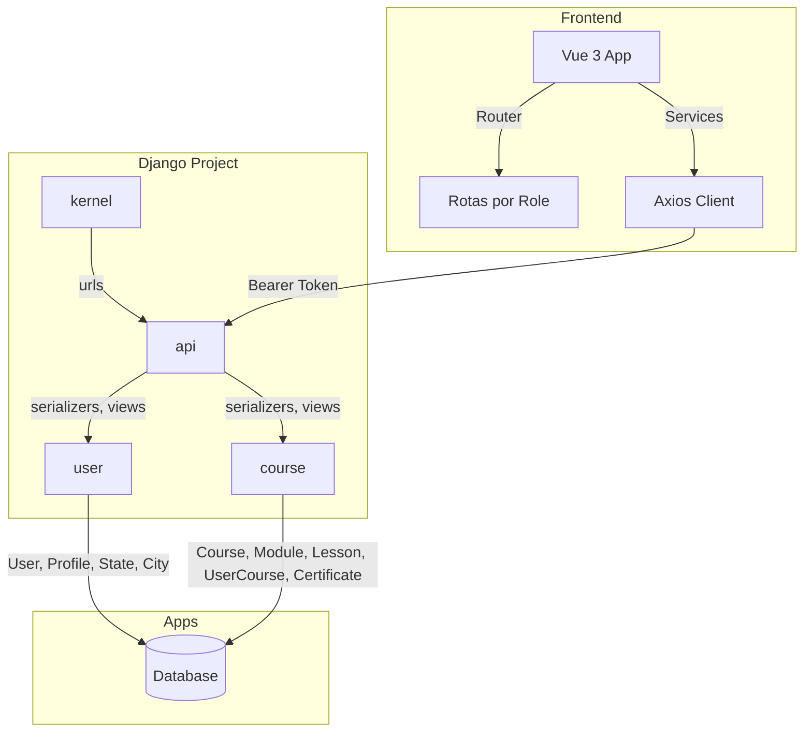

# Dossiê OnDance — Análise Técnica do Sistema

> Documento de análise sistêmica da plataforma OnDance.  
> Atualizado em: 12 de junho de 2026  
> Responsável: squad-ondance

---

## 1. Visão Geral Executiva

### Propósito
O **OnDance** é uma plataforma digital de ensino de dança da **ABCAA** (Associação Beneficente e Cultural Amor em Ação), onde alunos acessam cursos online, assistem aulas, acompanham progresso e recebem certificados. Professores publicam cursos e aulas, e a ABCAA gerencia a plataforma via time administrativo.

### Stack Tecnológico

| Camada | Tecnologia |
|--------|-----------|
| **Backend** | Python 3.13 + Django 6 + Django REST Framework 3.17 |
| **Autenticação** | JWT (`djangorestframework-simplejwt`) + OAuth Google (`django-allauth`) |
| **Gerenciamento de pacotes** | `uv` (backend) / `yarn` (frontend) |
| **Task runner** | `taskipy` |
| **Frontend** | Vue 3 + Quasar 2 (UI framework) + Vue Router 5 |
| **HTTP Client** | Axios com interceptors de refresh token |
| **Build** | Vite (`@quasar/app-vite`) |

### Perfis de Usuário

| Perfil | Identificação no Backend | Rotas Principais |
|--------|--------------------------|-----------------|
| **Aluno** | `is_student = True` | `/student/*` |
| **Professor** | `is_teacher = True` | `/teacher/*` |
| **Administrador** | `is_staff = True` | `/admin/*` |

> O campo `role` é uma **property** no model `User` que deriva dos booleanos acima.  
> O **admin** tem acesso irrestrito a todas as rotas do sistema.

---

## 2. Roadmap por Fases

### Fase 1 — Fundação ✅ (Concluída)

| Item | Status |
|------|--------|
| Setup do monorepo (`backend/` + `frontend/`) | ✅ |
| Configuração Django (settings, CORS, Whitenoise, JWT, allauth) | ✅ |
| Configuração Vue 3 + Quasar + Vite + Axios interceptors | ✅ |
| CI/CD GitHub Actions (lint + testes backend, lint + build frontend) | ✅ |
| Modelo de usuário customizado (`email` como login, `is_teacher`/`is_student`) | ✅ |
| Models de domínio (`Course`, `Module`, `Lesson`, `UserCourse`, `Certificate`, `Profile`, `City`, `State`) | ✅ |
| Fixtures de Estados (27) e Cidades (5.571) | ✅ |
| Autenticação JWT (login, refresh) | ✅ |
| Autenticação Social (Google OAuth) | ✅ |
| Sistema de 3 roles com rotas protegidas e layouts separados | ✅ |

### Fase 2 — Backend API 🟡 (70% concluído)

#### ✅ Já implementado
- **Usuários**: Registro, listagem (admin), troca de senha, perfil (GET/PATCH)
- **Cursos**: CRUD completo do professor, listagem pública, moderação (aprovar/rejeitar) pelo admin
- **Módulos & Aulas**: Criação/edição aninhada dentro do curso (nested write)
- **Serializers**: Todos os principais (`Course`, `Module`, `Lesson`, `Profile`, `User`, etc.)
- **Permissões**: `IsAdminUser` para rotas administrativas

#### 🚧 Falta implementar

| Item | Prioridade | Endpoint Esperado |
|------|------------|-------------------|
| **Matrícula do aluno** | 🔴 Alta | `POST /api/students/courses/:id/enroll/` |
| **Progresso do aluno** | 🔴 Alta | `PUT /api/students/courses/:id/progress/` |
| **Listagem de cursos do aluno** | 🔴 Alta | `GET /api/students/courses/` |
| **Certificados** | 🟡 Média | `GET /api/students/certificates/` + geração automática |
| **Contagem de alunos matriculados** | 🟡 Média | Incluir no `CourseSerializer` |
| **Corrigir prefixo duplicado de URL** | 🟢 Baixa | `/api/api/...` → `/api/...` |
| **Paginação e filtros avançados** | 🟢 Baixa | Search, status em listagens |

### Fase 3 — Frontend 🟡 (60% concluído)

#### ✅ Já implementado
- **Auth**: Login, registro, Google Sign-In, logout, refresh token automático
- **Layouts**: 3 layouts separados (`StudentLayout`, `TeacherLayout`, `AdminLayout`)
- **Router guard**: Redirecionamento por role, proteção de rotas
- **Perfil**: Edição com upload de foto, busca de cidade com autocomplete server-side
- **Professor**: Dashboard, criação/edição de cursos, listagem de cursos, listagem de alunos
- **Admin**: Dashboard, moderação de cursos, listagem de usuários
- **Aluno**: Explorar catálogo de cursos publicados

#### 🚧 Falta implementar

| Item | Prioridade | Rota |
|------|------------|------|
| **Player de aula** | 🔴 Alta | `/student/courses/:id/assistir` |
| **Matrícula em curso** | 🔴 Alta | Botão no catálogo de cursos |
| **Meus Cursos** do aluno | 🔴 Alta | `/student/my-courses` |
| **Tela de Progresso** | 🟡 Média | `/student/progresso` |
| **Certificados** | 🟡 Média | `/student/certificados` |
| **Ganhos do professor** | 🟢 Baixa | `/teacher/ganhos` |
| **Analytics do admin** | 🟢 Baixa | `/admin/analytics` |

### Fase 4 — Integração e Alinhamento ⚠️

| Problema | Impacto | Status |
|----------|---------|--------|
| Campo `role` no serializer vs. `is_teacher`/`is_student` no model | 🟢 Resolvido | ✅ Já ajustado (property `role` no `User`) |
| Nome do campo `title` vs `name` em algumas views do frontend | 🟡 Médio | 🟡 Requer revisão de consistência |
| `progress` (0-100) não existe no model `UserCourse` | 🔴 Alto | 🟡 Pode ser calculado via `lessons` assistidas |
| Serializer de `Course` não retorna `students` (quantidade) | 🟡 Médio | 🟡 Pendente de implementação |

### Fase 5 — Qualidade & Deploy

| Item | Status |
|------|--------|
| Testes backend com `pytest` + `pytest-django` | ✅ (parcialmente implementado) |
| Testes de integração (end-to-end) | ❌ Pendente |
| Upload de mídia (fotos, vídeos) para produção | 🟡 Local funciona, S3/Cloudinary pendente |
| Deploy homologação | ❌ Pendente |
| Deploy produção | ❌ Pendente |

---

## 3. Diagrama de Arquitetura

### 3.1 Fluxo de Requisição



### 3.2 Relação entre Apps do Backend



---

## 4. Tabela de Models e Campos

### 4.1 `User` (autenticação)

| Campo | Tipo | Descrição |
|-------|------|-----------|
| `id` | `UUIDField` | PK, auto-gerado |
| `email` | `EmailField` | Único, usado como login |
| `password` | `CharField` | Hash da senha (herdado do `AbstractBaseUser`) |
| `is_teacher` | `BooleanField` | Define se é professor |
| `is_student` | `BooleanField` | Define se é aluno (padrão: `True`) |
| `is_active` | `BooleanField` | Usuário ativo (padrão: `True`) |
| `is_staff` | `BooleanField` | Define se é admin (padrão: `False`) |

> **Property**: `role` → retorna `'admin'`, `'professor'` ou `'aluno'`.

### 4.2 `Profile` (dados pessoais)

| Campo | Tipo | Descrição |
|-------|------|-----------|
| `id` | `UUIDField` | PK |
| `user` | `OneToOneField` → `User` | Relação 1:1 |
| `name` | `CharField` | Nome completo |
| `photo` | `ImageField` | Foto de perfil |
| `city` | `FK` → `City` | Cidade do usuário |
| `celular` | `CharField` | Celular |
| `telephone` | `CharField` | Telefone fixo |
| `birthday` | `DateField` | Data de nascimento |

### 4.3 `State` e `City` (localização)

| Model | Campos | Descrição |
|-------|--------|-----------|
| `State` | `id` (UUID), `name`, `abbreviation` (2 chars) | 27 estados brasileiros |
| `City` | `id` (UUID), `name`, `state` (FK) | 5.571 municípios |

### 4.4 `Course` (curso)

| Campo | Tipo | Descrição |
|-------|------|-----------|
| `id` | `UUIDField` | PK |
| `title` | `CharField` | Título do curso |
| `description` | `TextField` | Descrição |
| `duration` | `CharField` | Duração (ex: "4 semanas") |
| `level` | `CharField` | Nível (Iniciante/Intermediário/Avançado) |
| `emoji` | `CharField` | Emoji decorativo |
| `thumb_bg` | `CharField` | Cor hex do background do card |
| `teacher` | `FK` → `User` | Professor criador |
| `is_published` | `BooleanField` | Visível publicamente |
| `status` | `CharField` | `PENDING`, `APPROVED`, `REJECTED` |

> **Serializer** retorna `modules_count` e `lessons_count` via `SerializerMethodField`.

### 4.5 `Module` (módulo)

| Campo | Tipo | Descrição |
|-------|------|-----------|
| `id` | `UUIDField` | PK |
| `course` | `FK` → `Course` | Curso pai |
| `title` | `CharField` | Título do módulo |
| `order` | `PositiveIntegerField` | Ordenação |
| `lessons` | `Reverse FK` | Lista de aulas (nested) |

### 4.6 `Lesson` (aula)

| Campo | Tipo | Descrição |
|-------|------|-----------|
| `id` | `UUIDField` | PK |
| `module` | `FK` → `Module` | Módulo pai |
| `title` | `CharField` | Título da aula |
| `video_url` | `URLField` | Link do vídeo |
| `order` | `PositiveIntegerField` | Ordenação |

### 4.7 `UserCourse` (matrícula / progresso)

| Campo | Tipo | Descrição |
|-------|------|-----------|
| `id` | `UUIDField` | PK |
| `profile` | `FK` → `Profile` | Aluno |
| `course` | `FK` → `Course` | Curso |
| `started_at` | `DateTimeField` | Data de início |
| `completed_at` | `DateTimeField` | Data de conclusão (nullable) |
| `is_completed` | `BooleanField` | Concluído |

> **Pendência**: campo `progress` (0-100) não existe — pode ser calculado pelo frontend ou adicionado ao model.

### 4.8 `Certificate` (certificado)

| Campo | Tipo | Descrição |
|-------|------|-----------|
| `id` | `UUIDField` | PK |
| `profile` | `FK` → `Profile` | Aluno |
| `course` | `FK` → `Course` | Curso |
| `issue_date` | `DateField` | Data de emissão |
| `code` | `CharField` | Código único do certificado |
| `file` | `FileField` | PDF gerado |

---

## 5. Endpoints da API

### 5.1 Autenticação

| Método | URL | Descrição | Permissão | Status |
|--------|-----|-----------|-----------|--------|
| `POST` | `/api/token/` | Login (JWT) | Público | ✅ |
| `POST` | `/api/token/refresh/` | Refresh token | Público | ✅ |
| `POST` | `/api/register/` | Cadastro | Público | ✅ |
| `POST` | `/api/password/change/` | Alterar senha | Autenticado | ✅ |
| `POST` | `/api/auth/social/google/` | Login com Google | Público | ✅ |

### 5.2 Perfil

| Método | URL | Descrição | Permissão | Status |
|--------|-----|-----------|-----------|--------|
| `GET` | `/api/profile/` | Meu perfil | Autenticado | ✅ |
| `PATCH` | `/api/profile/` | Atualizar perfil | Autenticado | ✅ |
| `GET` | `/api/profiles/` | Listar perfis (admin) | Admin | ✅ |

### 5.3 Localização

| Método | URL | Descrição | Permissão | Status |
|--------|-----|-----------|-----------|--------|
| `GET` | `/api/cities/` | Listar cidades | Público | ✅ |
| `GET` | `/api/states/` | Listar estados | Público | ✅ |

### 5.4 Cursos (Professor)

| Método | URL | Descrição | Permissão | Status |
|--------|-----|-----------|-----------|--------|
| `GET` | `/api/courses/` | Listar todos | Público (filtra publicados) | ✅ |
| `POST` | `/api/courses/` | Criar curso | Autenticado | ✅ |
| `GET` | `/api/courses/mine/` | Meus cursos | Autenticado | ✅ |
| `GET` | `/api/courses/<id>/` | Detalhe do curso | Autenticado (professor dono) | ✅ |
| `PUT` | `/api/courses/<id>/` | Editar curso | Autenticado (professor dono) | ✅ |
| `DELETE` | `/api/courses/<id>/` | Excluir curso | Autenticado (professor dono) | ✅ |

### 5.5 Cursos (Aluno)

| Método | URL | Descrição | Permissão | Status |
|--------|-----|-----------|-----------|--------|
| `GET` | `/api/courses/published/` | Catálogo público | Público | ✅ |
| `POST` | `/api/students/courses/<id>/enroll/` | Matricular-se | Autenticado | ❌ |
| `GET` | `/api/students/courses/` | Meus cursos | Autenticado | ❌ |
| `PUT` | `/api/students/courses/<id>/progress/` | Atualizar progresso | Autenticado | ❌ |
| `GET` | `/api/students/certificates/` | Meus certificados | Autenticado | ❌ |

### 5.6 Administração

| Método | URL | Descrição | Permissão | Status |
|--------|-----|-----------|-----------|--------|
| `GET` | `/api/admin/courses/` | Listar cursos p/ moderação | Admin | ✅ |
| `POST` | `/api/admin/courses/<id>/approve/` | Aprovar curso | Admin | ✅ |
| `POST` | `/api/admin/courses/<id>/reject/` | Rejeitar curso | Admin | ✅ |
| `GET` | `/api/admin/users/` | Listar usuários | Admin | ✅ |
| `GET` | `/api/teacher/students/` | Alunos do professor | Autenticado | ✅ |

---

## 6. Permissões Customizadas

| Classe | Regra | Localização |
|--------|-------|-------------|
| `IsTeacher` | `request.user.is_authenticated and request.user.is_teacher` | `course/permissions.py` |
| `IsOnDanceAdmin` | `request.user.is_authenticated and request.user.is_staff` | `course/permissions.py` |

> **Nota**: As permissões customizadas existem, mas as views atuais usam principalmente `permissions.IsAuthenticated` e `permissions.IsAdminUser` do DRF. As permissões customizadas podem ser aplicadas para reforçar o controle de acesso do professor.

---

## 7. Infraestrutura e Configurações

### 7.1 Paginação
- **Classe**: `CustomPagination` (`user/pagination.py`)
- **Page size**: 25 (padrão), 100 (máximo)
- **Resposta paginada**: `count`, `returned`, `next`, `previous`, `results`

### 7.2 Throttling (Rate Limiting)

| Escopo | Taxa | Uso |
|--------|------|-----|
| `anon` | 60/minuto | Requisições anônimas |
| `register` | 5/minuto | Cadastro |
| `token` | 10/minuto | Login JWT |
| `social_auth` | 10/minuto | Login social |

### 7.3 Variáveis de Ambiente Críticas

```
SECRET_KEY=
DEBUG=True
ALLOWED_HOSTS=127.0.0.1, .localhost
DATABASE_URL=postgres://...
FRONTEND_URL=http://localhost:3000
GOOGLE_CLIENT_ID=
```

---

## 8. Próximos Passos Recomendados

### 🔴 Crítico (Bloqueante para o MVP)

1. **Implementar matrícula do aluno**
   - Endpoint: `POST /api/students/courses/<id>/enroll/`
   - Criar registro em `UserCourse` com `started_at`

2. **Implementar progresso do aluno**
   - Endpoint: `PUT /api/students/courses/<id>/progress/`
   - Receber `lesson_id` marcado como assistido
   - Calcular % de progresso
   - Se 100%, setar `is_completed = True` e gerar `Certificate`

3. **Implementar "Meus Cursos" do aluno**
   - Endpoint: `GET /api/students/courses/`
   - Retornar cursos matriculados com `progress` e `is_completed`

4. **Player de aula no frontend**
   - Tela: `/student/courses/<id>/assistir`
   - Exibir vídeo da aula e botão "Marcar como concluída"

### 🟡 Médio (Valor agregado)

5. **Geração automática de certificados**
   - Trigger: quando `is_completed = True`
   - Gerar PDF com `code` único e salvar em `Certificate.file`

6. **Contagem de alunos por curso**
   - Adicionar `students_count` ao `CourseSerializer`

7. **Tela de Certificados do aluno**
   - Rota: `/student/certificados`
   - Listar certificados com download do PDF

### 🟢 Baixo (Polimento)

8. **Corrigir prefixo duplicado de URL**
   - `api/urls.py` já define `/api/`, mas está sendo incluído em `kernel/urls.py` com `path('api/', ...)` → resulta em `/api/api/...`

9. **Melhorar filtros de listagem**
   - Search por nome/email em `admin/users/`
   - Filtro por status em `admin/courses/`

10. **Testes E2E**
    - Fluxo completo: login → explorar → matricular → assistir → concluir → certificado

---

## 9. Resumo de Cobertura

| Área | Total | Alinhado | Pendente |
|------|-------|----------|----------|
| Campos de entidades | ~40 | ~35 | ~5 |
| Serializers | 12 | 10 | 2 |
| Endpoints | 22 | 16 | 6 |
| Telas do frontend | 18 | 12 | 6 |
| Permissões | 2 | 2 | 0 |

---

*Fim do Dossiê.*
